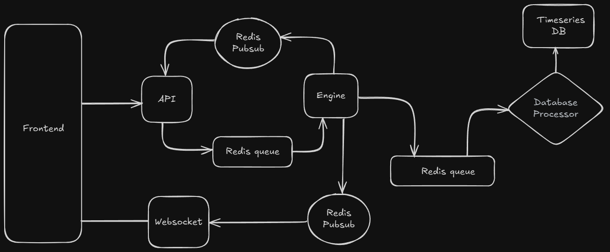

# CryptoXchange 📊

A high-performance cryptocurrency exchange platform built with Go and Next.js, featuring real-time order matching, WebSocket communication, with trading interface.

## 📋 Table of Contents

- [Overview](#overview)
- [Features](#features)
- [Architecture](#architecture)
- [Installation](#installation)
- [Getting Started](#getting-started)
- [API Documentation](#api-documentation)

## 🔍 Overview

CryptoXchange is a full-stack cryptocurrency trading platform that provides:

- **Real-time Order Matching**: High-performance order book engine for efficient trade execution
- **WebSocket Integration**: Live price feeds and order updates
- **Modern UI**: Responsive Next.js frontend with TradingView-style charts

## ✨ Features

### Core Trading Features
- 📊 **Real-time Order Book** - Live bid/ask display with market depth
- 💱 **Spot Trading** - Limit order execution
- 📈 **Price Charts** - TradingView-style candlestick charts
- 🔄 **Trade History** - Complete transaction records and analytics

## 🏗️ Architecture



## 📥 Installation

### 1. Clone the Repository

```bash
git clone https://github.com/Althaf66/cryptoXchange.git
cd cryptoXchange
```

### 2. Set Up Environment

```bash
go mod tidy
```

## 🚀 Getting Started

### Quick Start (Recommended)

1. **Start the database services:**
   ```bash
   docker-compose up -d
   ```

2. **Start the API server:**
   ```bash
   cd cmd/api
   go run .
   ```

3. **Start the trading engine:**
   ```bash
   cd cmd/engine
   go run .
   ```

4. **Start the WebSocket server:**
   ```bash
   cd cmd/websocket
   go run .
   ```

5. **Start the frontend:**
   ```bash
   cd frontend
   npm install
   npm run dev
   ```

6. **Access the application:**
  - Open the browser and navigate to http://localhost:3000/trade/SOL_USD

### Service URLs

| Service | URL | Description |
|---------|-----|-------------|
| Frontend | http://localhost:3000 | Main trading interface |
| API Server | http://localhost:8080/v1 | REST API endpoints |
| WebSocket | ws://localhost:3001/v1/ws | Real-time data feed |
| Database | localhost:5432 | PostgreSQL (TimescaleDB) |
| Redis | localhost:6379 | Queue and pub/sub |

## 📚 API Documentation

### For API Testing

- Use Postman or other alternatives for send requests to APIs and view the responses

#### Create an order in orderbook
- Send POST request to http://localhost:8080/v1/order with JSON body
> **Note**: Only users with IDs 1, 2, and 5 have sufficient SOL and USD balances for testing by default.
- For buy order
```
{
    "market": "SOL_USD",
    "price": "200",
    "quantity": "1",
    "side": "buy",
    "userid": "1"
}
```
- For sell order
```
{
    "market": "SOL_USD",
    "price": "200",
    "quantity": "1",
    "side": "sell",
    "userid": "2"
}
```

#### To getting depth in orderbook 

- Send GET request to http://localhost:8080/v1/depth 

#### To getting current price

- Send GET request to http://localhost:8080/v1/latestprice

#### To add balance to the users

- Send GET request to http://localhost:8080/v1/onramp
- Adding amount 20000 usd to userid 6
```
{
    "amount": "20000",
    "userId": "6"
}
```
#### To get all past trades

- Send GET request to http://localhost:8080/v1/trades
