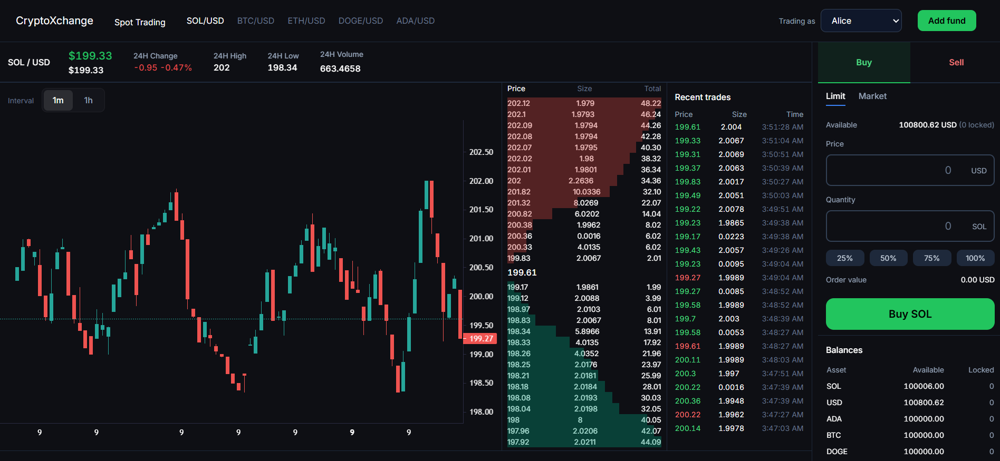
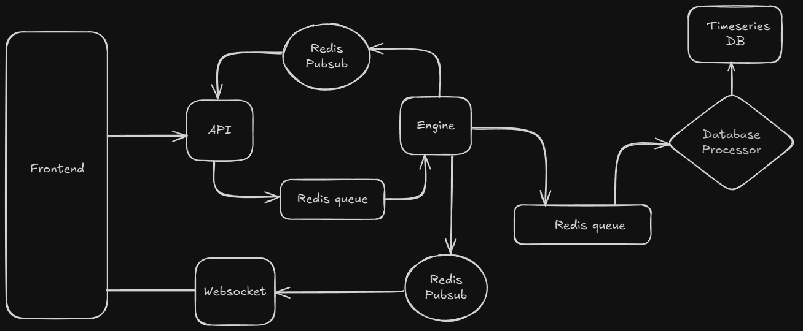

# CryptoXchange 📊

CryptoXchange is a virtual trading environment, It replicates the conditions of live markets, including price movements, spreads, and trading tools, but without the risk of losing actual money.

It is a spot exchange with an actual matching engine behind it. It matches limit and market orders by price-time priority, fills across multiple price levels.

Placing an order locks the funds it needs, canceling releases them, and filling at a better price than requested refunds the difference automatically.

The whole book lives in memory, the engine snapshots itself to disk every 5 seconds and on shutdown, so a restart doesn't wipe out open orders or balances. Trades flow out over Redis pub/sub to a WebSocket service that fans out live depth and trade updates to the browser, and separately into TimescaleDB, where continuous rollups turn them into 1-minute and 1-hour candles for a TradingView-style chart.

Deployed at Zerops

## 📸 Screenshot




## 📋 Table of Contents

- [Live Demo](#-live-demo)
- [What is this?](#-what-is-this)
- [Features](#-features)
- [Overview](#-overview)
- [Tech Stack](#%EF%B8%8F-tech-stack)
- [Architecture](#%EF%B8%8F-architecture)
- [Getting Started](#-getting-started)
- [How to Use](#-how-to-use)
- [Deployment on Zerops](#-deployment-on-zerops)

## 🔴 Live Demo

**https://frontend-2e5c-3000.prg1.zerops.app/**

Running live on Zerops - no signup, just pick a demo user and start trading.

## 🔍 What is this?

CryptoXchange is a full spot exchange built from scratch: a single-threaded
price-time matching engine, a real balance ledger (funds actually lock and
unlock), live order book/trade streams over WebSocket, and a Next.js trading
UI with TradingView-style candlestick charts. There's no mocked backend and no
fake order book — every fill, partial fill, and balance change comes out of
the same engine you'd need for a real exchange. It's built as a demo/learning
project, so it ships with instant demo users instead of a signup flow and a
market maker bot that keeps the book from looking dead.

### 🎥 Demo Video
   https://www.loom.com/share/bbcc2ea1986a43c394a52d03af7973ef

## ✨ Features

- **Price-time priority matching** with fractional quantities, partial fills,
  and fills across multiple price levels
- **Limit and market orders** - market orders sweep the book and never rest
- **Real balance accounting**: funds are locked on order placement, released
  on cancel, and any surplus from filling at a better price is refunded
- **Live order book and trade tape** over WebSocket
- **TradingView-style candlestick charts** backed by TimescaleDB continuous
  rollups
- **Crash-safe**: the engine restores its book and balances from a snapshot
  on boot
- **JWT-based signup/login**, plus a demo mode that skips auth entirely via
  instant virtual users
- **Multi-market**: SOL, BTC, ETH, DOGE, ADA, all USD-quoted
- **Self-sustaining demo markets** - a market maker bot keeps resting depth
  and trade history alive with no real users needed
- **Deploy-anywhere**: Docker Compose for local dev, Zerops config included
  for one-command cloud deployment

## 🏗️ Overview

Five pieces talk to each other over Redis and Postgres:

| Service | Role |
|---|---|
| `cmd/api` | REST API. Forwards order commands to the engine over a Redis list and waits for the reply on a pub/sub channel. Also runs the kline data processor as a background goroutine. |
| `cmd/engine` | Single-threaded matching engine. Owns the order book **and** all balances; snapshots to disk every 5s. |
| `cmd/websocket` | Fans out `depth@{market}` and `trade@{market}` streams to browsers. |
| `cmd/marketmaker` | Demo-only bot. Every tick, re-centers a bid/ask ladder and prints a few trades against its own accounts so the book and charts stay alive with no real users trading. |
| `internal/kline` | Runs inside `cmd/api`; consumes executed trades off Redis into TimescaleDB, which rolls them into 1m/1h candles. |

## 🛠️ Tech Stack

- **Backend**: Go 1.24 — `gorilla/mux`, `go-redis`, `lib/pq`, `golang-jwt`, `zap`
- **Frontend**: Next.js 14, React 18, TypeScript, Tailwind CSS, `lightweight-charts`
- **Data**: TimescaleDB (Postgres) for durable state and candles, Redis for the command bus and pub/sub
- **Deployment**: Docker Compose (local), Zerops (cloud)

## 🏗️ Architecture



## 🚀 Getting Started

### 1. Backend - everything in one command

```bash
docker compose up -d --build
```

That brings up TimescaleDB, Redis, the API, the matching engine, the
WebSocket server, and the market maker bot. The engine's snapshot lives in a
named volume, so restarts keep the order book and balances.

<details>
<summary>Or run the Go services from source</summary>

```bash
docker compose up -d db redis    # infrastructure only
go run ./cmd/api                 # each in its own terminal
go run ./cmd/engine
go run ./cmd/websocket
go run ./cmd/marketmaker
```
</details>

Configuration is optional - every value in `.env.example` has a working
localhost default.

### 2. Frontend

```bash
cd frontend && npm install && npm run dev
```

### 3. Seed a market

An empty order book is a bad first impression. This places resting depth
around 200.00 and executes a few trades so the chart has history:

```bash
go run ./script/seed
```

### 4. Open the app

http://localhost:3000/trade/SOL_USD

| Service | URL |
|---------|-----|
| Frontend | http://localhost:3000/trade/SOL_USD |
| API Server | http://localhost:8080/v1 |
| WebSocket | ws://localhost:3001/v1/ws |
| Database | localhost:5432 |
| Redis | localhost:6379 |

## 🎬 How to Use

No signup needed - pick a demo user from the **Trading as** dropdown and
start trading:

- Place a **limit** order and watch it rest on the book instantly
- Place a **market** order and watch it sweep whatever liquidity is available
- Fill someone else's order by clicking a price level in the book
- Watch the trade tape and candlestick chart update live as fills happen
- Cancel an open order and see the locked balance return to available
- Try over-spending and get a real `insufficient funds` rejection from the
  engine, not a UI-only check
- Credit an account through the onramp endpoint if you want more balance to
  play with

## ☁️ Deployment on Zerops

The [live demo](#-live-demo) runs entirely on [Zerops](https://zerops.io).
Locally, `docker-compose.yaml` brings up the full stack in one command; in the
cloud, `zerops.yml` + `zerops-project-import.yml` bring up the same seven
services from a single `zcli project project-import` - no manual clicking
through a dashboard.

A few things about the setup worth calling out:

- **7 services, one import**: TimescaleDB, Redis (managed Valkey), API,
  matching engine, WebSocket server, market maker, and the Next.js frontend
  all deploy together.
- **The engine's snapshot survives redeploys**: it writes to Zerops shared
  storage (`/mnt/snapshots`) instead of local disk, and the engine is pinned
  to a single instance since its order book and balances live in memory.
